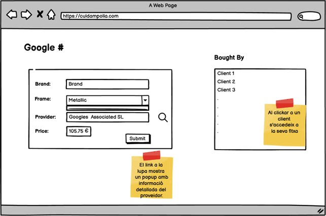

# 🕶️ Optics Store “Bottleneck Optics” – MongoDB Project

## 📋 Project Statement

We will create different databases using MongoDB.

### Level 1 – Optics Store

An optics store called **“Bottleneck Optics”** wants to digitalize the management of its customers and glasses sales.

- First, the store wants to track the **supplier of each pair of glasses**. For each supplier, the following information should be stored:
  - Name
  - Address (street, number, floor, door, city, postal code, country)
  - Phone number
  - Fax
  - Tax ID (NIF)

- For **glasses**, we want to store:
  - Brand
  - Lens graduation for each eye
  - Frame type (floating, plastic, or metal)
  - Frame color
  - Lens color for each eye
  - Price

- For **clients**, we store:
  - Name
  - Postal address
  - Phone number
  - Email address
  - Registration date
  - Optionally, which existing client recommended them

- The system must also record **which employee sold each pair of glasses and the date/time of the sale**.

---

## 🧠 Database Description

The MongoDB database is structured into several key collections:

- `suppliers`: Contains all supplier details.
- `glasses`: Technical and pricing information for each pair of glasses, linked to a supplier.
- `clients`: Client information, including referral details.
- `employees`: Store employees.
- `sales`: Sales records linking clients, glasses, employees, and timestamps.

The model uses **referenced ObjectIds** to connect entities in a flexible, scalable manner.

---

## 👀 Exercise 1 – User Perspective

From the customer’s point of view, the system should allow:


---

## 👓 Exercise 2 – Glasses Perspective

When viewing the system from the point of view of the glasses:



---

## 🧰 Technologies Used

- **MongoDB**: MongoDB v7.0.8
- **MongoDB Compass**: MongoDB Compass v1.46.1
- **Docker**: Containerization platform for deploying MongoDB locally.
- **JSON**: Data format used for importing documents.

---

## 🚀 How to Run the Project

1. **Clone this repository:**
   ```bash
   git clone https://github.com/aredondocharro/S2.03.Data_Structure_MongoDB.Lvl1.git
   cd optics-mongodb
   ```

2. **Start MongoDB using Docker:**
   ```bash
   docker run -d -p 27017:27017 --name optics-mongo mongo
   ```

3. **Open MongoDB Compass and connect to:**
   ```
   mongodb://localhost:27017
   ```

4. **Import JSON collections:**
   - Open each collection (`suppliers`, `glasses`, `clients`, `employees`, `sales`)
   - Use Compass’s import feature to load each JSON file.

5. **Browse and analyze your documents through the GUI.**

---

> This project was created as a hands-on exercise to learn MongoDB database modeling, perspectives in data design, and Docker-based deployment for development environments.
